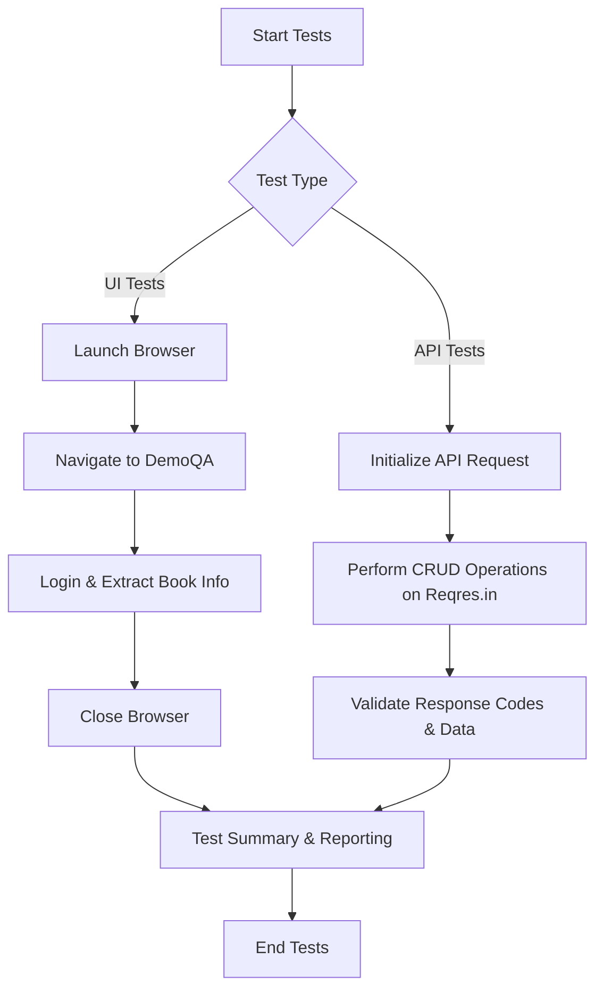

# Playwright Automation

This repository contains UI and API automation tests using Playwright.

## Prerequisites
- Node.js installed on your machine.

## Setup Instructions
1. Clone the repository.
2. Run `npm install` to install all dependencies.
3. If this is your first time using Playwright, run `npx playwright install --with-deps` to install the required browsers.
4. Ensure you have a `.env` file in the root of the project with the following credentials:
   ```env
   API_KEY=pro_27cc66a86e552953ea476bb238ac39dcae13fd5da63a900b
   DEMOQA_USERNAME=Johnhere0067
   DEMOQA_PASSWORD=John@Pulkz007
   ```

## Running the Tests
To run all tests (UI and API):
```bash
npx playwright test
```

To run only the API tests:
```bash
npx playwright test tests/api.spec.js
```

To run only the UI tests:
```bash
npx playwright test tests/assignment.spec.js
```

The UI tests will run in headed mode by default, meaning you will see the browser open and execute the steps. Tests are fully automated and results will be generated automatically.


## How This Project Works
This project uses Playwright to perform automated testing. It is divided into two main categories:
1. **UI Testing**: Scripts interact with a web application (e.g., DemoQA) as a real user would—clicking buttons, filling forms, and extracting data from the webpage.
2. **API Testing**: Scripts directly communicate with backend services (e.g., Reqres.in) using HTTP requests to verify data integrity, structure, and server responses without interacting with a graphical interface.

All test configurations and credentials are kept secure using environment variables, ensuring that sensitive data is not exposed in the codebase.

## Workflow Diagram



## How I Made This Project
1. Initialized a Node.js project and installed the necessary dependencies, primarily `@playwright/test` and `.env`.
2. Created a structured repository separating tests into specific files (`assignment.spec.js` for UI and `api.spec.js` for API).
3. Developed UI test scripts using Playwright's browser automation capabilities, specifically handling elements, selectors, and assertions.
4. Developed API test scripts utilizing Playwright's built-in `request` fixture to test RESTful APIs efficiently without requiring external libraries like Axios.
5. Configured environment variables (`.env`) to safely store sensitive data like usernames, passwords, and API keys.

## Why It Is Useful
- **Quality Assurance**: Automatically ensures that both the frontend interface and the backend APIs are functioning correctly.
- **Time Saving**: Replaces tedious manual testing with rapid, automated scripts that can be run continuously.
- **Reliability**: Catches bugs and regressions early in the development lifecycle before they reach production.
- **Documentation**: Acts as living documentation of how the application is expected to behave under various scenarios.

## Advantages
- **Unified Framework**: Both UI and API testing are handled within a single framework (Playwright), reducing the learning curve and simplifying the technology stack.
- **Fast Execution**: Tests run extremely quickly thanks to Playwright's lightweight architecture.
- **Headless & Headed Modes**: Flexible execution modes for either CI/CD pipelines (headless) or debugging (headed).
- **Environment Management**: Secure handling of test data through `.env` integration.

### Why Playwright is Better Than Selenium
- **Auto-Wait**: Playwright automatically waits for elements to be actionable (visible, enabled, stable) prior to performing actions, significantly reducing test flakiness compared to Selenium's explicit or implicit waits.
- **Modern Web Support**: Better handles modern web applications with complex asynchronous behavior, single-page applications (SPAs), Shadow DOM, and iframes.
- **Built-in API Testing**: Playwright comes with built-in capabilities to intercept network requests and perform direct API testing without needing third-party libraries, whereas Selenium is strictly for UI automation.
- **Speed**: Playwright communicates directly with the browser using WebSocket, avoiding the overhead of Selenium's HTTP-based WebDriver protocol, resulting in faster and more reliable execution.
- **Cross-Browser Support**: Playwright provides out-of-the-box support for Chromium, WebKit, and Firefox engines using a single unified API.
